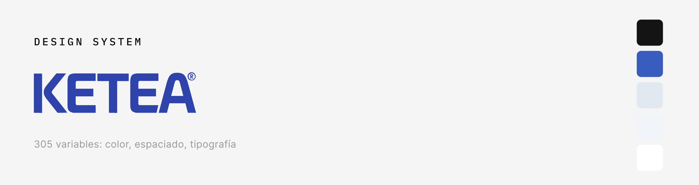

# Ketea Design System — Token Infrastructure

Design token pipeline for [Ketea](https://tienda-ketea.vercel.app) — an Argentine e-commerce specializing in pool equipment. Tokens authored once as DTCG, synced from Figma via Tokens Studio, generated to CSS and Tailwind through Style Dictionary.

---

## What's in this repo

```
tokens/
  ketea-tokens-final.json   ← single source of truth (Tokens Studio format)
style-dictionary/
  config.js                 ← Style Dictionary build config
output/
  css/tokens.css            ← CSS custom properties
  tailwind/tokens.js        ← Tailwind theme extension
.github/
  workflows/build.yml       ← Auto-build on push to main
```

---

## Token architecture

Three layers, each depending only on the one above it:

```
Primitives  →  color.Blue.600 = #385DBE
                 ↓
Semantic    →  color.Semantic.brand-primary = {color.Blue.600}
                 ↓
Component   →  Button.background = {color.Semantic.brand-primary}
```

Components only consume semantic tokens — never primitives directly. Changing a primitive propagates through the entire system automatically.

---

## Collections (305 variables)

| Collection | Variables | Description |
|---|---|---|
| `color` | ~200 | Primitives: Blue, Amber, Red, Green, Grey, White, Black |
| `color.Semantic` | ~40 | Role aliases: brand, surface, text, border, feedback, commerce |
| `spacing` | 18 | Base-4 scale: 4px → 128px |
| `radius` | 8 | none → full (9999px) |
| `shadow` | 6 | xs → xl + focus ring |
| `font` | ~30 | family, weight, size, lineHeight, letterSpacing |
| `border` | 4 | width: default, medium, thick, focus |
| `opacity` | 3 | disabled (0.4), overlay (0.45), hover (0.08) |

---

## Semantic token groups

### Brand
| Token | Value | Use |
|---|---|---|
| `color.Semantic.brand-primary` | `Blue.600` (#385DBE) | CTAs, links, focus rings |
| `color.Semantic.brand-primary-hover` | `Blue.700` | Hover state on primary elements |
| `color.Semantic.brand-primary-subtle` | `Blue.50` | Active chip backgrounds, selection |
| `color.Semantic.brand-accent` | `Amber.500` | Discount badges, promo |

### Commerce (ecommerce-specific)
| Token | Value | Use |
|---|---|---|
| `color.Commerce.price-current` | `Grey.700` | Current product price |
| `color.Commerce.price-original` | `Grey.300` | Strikethrough / previous price |
| `color.Commerce.price-discount` | `Amber.500` | Discount percentage |
| `color.Commerce.shipping-free` | `Green.600` | "Envío Gratis" label |
| `color.Commerce.stock-low` | `Amber.600` | "Último en stock" |
| `color.Commerce.stock-unavailable` | `Red.600` | "Sin Stock" |

### Feedback
| Token | Use |
|---|---|
| `color.Semantic.feedback-error-*` | Form validation errors |
| `color.Semantic.feedback-success-*` | Order confirmation, stock ok |
| `color.Semantic.feedback-warning-*` | Low stock, expiring promo |

---

## How to use tokens in code

### CSS custom properties

```css
/* output/css/tokens.css is auto-generated — import it once */
@import './tokens/css/tokens.css';

.btn-primary {
  background: var(--color-semantic-brand-primary);
  color: var(--color-white);
  border-radius: var(--radius-md);
  height: var(--size-touch-min); /* 44px — WCAG 2.5.5 */
}
```

### Tailwind

```js
// tailwind.config.js
const tokens = require('./tokens/tailwind/tokens.js');

module.exports = {
  theme: {
    extend: tokens,
  },
};
```

```html
<button class="bg-brand-primary text-white rounded-md h-touch-min">
  Agregar al carrito
</button>
```

### React + TypeScript

```tsx
import tokens from './tokens/ketea-tokens-final.json';

const brandColor = tokens.color.Semantic['brand-primary'].value;
```

---

## Sync workflow

Tokens live in Figma and sync bidirectionally via Tokens Studio → GitHub.

```
Figma Variables
      ↕  (Tokens Studio plugin)
GitHub (this repo) → main branch
      ↓  (GitHub Actions on push)
Style Dictionary build
      ↓
output/css/tokens.css
output/tailwind/tokens.js
```

To update tokens:
1. Edit variables in Figma
2. Tokens Studio → Push to GitHub
3. GitHub Actions builds the output automatically
4. Import updated CSS/Tailwind in the frontend project

---

## Figma file

- **Design System:** [Figma — Ketea DS](https://www.figma.com/design/lXKFv02FouHJOUG9Qrsib2)
- **Live site:** [tienda-ketea.vercel.app](https://tienda-ketea.vercel.app)
- **Portfolio case study:** [emilianoroman.com.ar/projects/ketea-website](https://www.emilianoroman.com.ar/projects/ketea-website)

---

## Accessibility

Color tokens are audited against WCAG 2.1 AA:
- Text on `surface-default` (white): all text tokens pass 4.5:1 minimum
- White text on `brand-primary` (#385DBE): ~4.7:1 — passes AA
- `feedback-error-text` on `feedback-error-bg`: passes AA
- Touch targets: `size.touch-min` = 44px (WCAG 2.5.5)

---

## Stack

| Tool | Role |
|---|---|
| Figma + Variables | Single source of truth for design |
| Tokens Studio | Figma ↔ GitHub sync |
| Style Dictionary | Token transformation to CSS/JS |
| GitHub Actions | Auto-build pipeline |
| Tailwind CSS | Frontend consumption |
| React / Next.js | Component implementation |

---

*Emiliano Román — UX/UI Designer & Design Technologist — Buenos Aires, Argentina*
*[emilianoroman.com.ar](https://www.emilianoroman.com.ar)*
