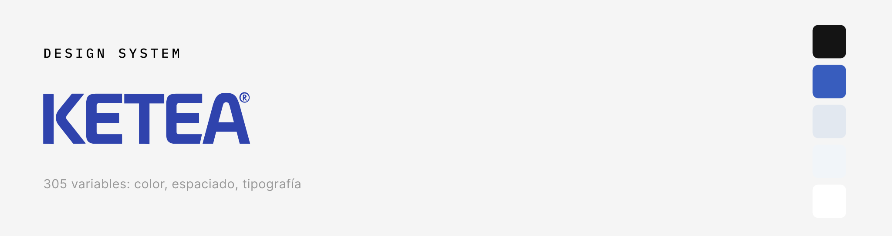

# Ketea Design System: Token Infrastructure

Design token pipeline for [Ketea](https://tienda-ketea.vercel.app), an Argentine e-commerce specializing in pool equipment. Tokens are authored in Figma, synced to this repo via Tokens Studio, and built with Style Dictionary v4 into CSS custom properties, a JS module and a Tailwind preset.

---

## What's in this repo

```
tokens/
  ketea-tokens.json       ← single source of truth (Tokens Studio / DTCG format)
build.mjs                 ← Style Dictionary v4 config + custom formats
dist/                     ← generated, committed
  tokens.css              ← CSS custom properties (--ketea-*) with references + RGB channels
  tokens.js               ← ES module, one named export per token
  tailwind-tokens.js      ← Tailwind preset with semantic utility names
assets/
  cover-tokens.svg
.github/workflows/
  build-tokens.yml        ← rebuilds dist/ when tokens/ changes
```

---

## Token architecture

Three layers, each depending only on the one above it:

```
Primitive   →  color.Blue-brand.700 = #385DBE
                 ↓
Alias       →  color.Brand.Default = {color.Blue-brand.700}
                 ↓
Semantic    →  color.Semantic.text-link = {color.Brand.700}
```

Components consume semantic tokens, never primitives directly. The CSS output keeps the reference chain, so changing a primitive propagates through the whole system:

```css
--ketea-color-blue-brand-700: #385dbe;
--ketea-color-brand-700: var(--ketea-color-blue-brand-700);
--ketea-color-semantic-text-link: var(--ketea-color-brand-700);
```

---

## Collections (282 tokens)

| Collection | Tokens | Description |
|---|---|---|
| `color` (primitives) | 156 | 14 ramps × 11 steps (Neutral, Slate, Rose, Pink, Purple, Violet, Blue-brand, Indigo, Blue, Sky, Green, Yellow, Orange, Red) + White, Black |
| `color.Brand` | 14 | Alias of Blue-brand (50–950) + `Default`, `Hover`, `Subtle` |
| `color.Semantic` | 42 | surface, text, border, icon, feedback, forms |
| `spacing` | 17 | Base-4 scale: 4px → 256px |
| `radius` | 8 | none → full (9999px) |
| `shadow` | 6 | xs → xl + focus ring |
| `font` | 24 | family (Mulish, JetBrains Mono), weight, size, lineHeight |
| `border` | 4 | width: sm (1), md (1.5), lg (2), focus (3) |
| `opacity` | 3 | disabled (0.4), overlay (0.45), hover (0.08) |
| `size` | 8 | touch-min (44px), icon sizes, containers |

---

## Semantic token groups

### Brand
| Token | Value | Use |
|---|---|---|
| `color.Brand.Default` | `Blue-brand.700` (#385DBE) | CTAs, primary actions |
| `color.Brand.Hover` | `Blue-brand.800` (#2A4A9E) | Hover on primary elements |
| `color.Brand.Subtle` | `Blue-brand.50` (#F2F5FD) | Active chips, selection |
| `color.Semantic.text-link` | `Brand.700` | Links |
| `color.Semantic.border-focus` | `Brand.700` | Focus rings |

### Surface, text, border
| Group | Tokens |
|---|---|
| `surface-*` | page, default, subtle, muted, inverse, overlay |
| `text-*` | primary, secondary, tertiary, disabled, inverse, link, link-hover, on-brand |
| `border-*` | default, strong, focus |
| `icon-*` | default, subtle, brand, inverse |

### Feedback & forms
| Token | Use |
|---|---|
| `feedback-{success,warning,error,info}-{text,bg,border}` | Validation, order confirmation, stock notices |
| `forms-*` | Input background, border (default, hover, focus, error), placeholder, disabled |

---

## How to use tokens in code

### CSS custom properties

```css
/* dist/tokens.css is generated: import it once */
@import "@ketea/tokens/tokens.css";

.btn-primary {
  background: var(--ketea-color-brand-default);
  color: var(--ketea-color-semantic-text-on-brand);
  border-radius: var(--ketea-radius-md);
  min-height: var(--ketea-size-touch-min); /* 44px */
}
```

### Tailwind

```js
// tailwind.config.js
module.exports = {
  presets: [require("@ketea/tokens/tailwind")],
  content: ["./src/**/*.{ts,tsx}"],
};
```

```html
<button class="bg-brand hover:bg-brand-hover text-on-brand rounded-md min-h-touch-min px-6">
  Agregar al carrito
</button>
<input class="bg-input border border-input focus:border-input-focus placeholder-input" />
<p class="text-error bg-error-subtle border border-error">Sin stock</p>
```

| Token | Tailwind utility |
|---|---|
| `color.Semantic.surface-*` | `bg-page`, `bg-default`, `bg-subtle`, `bg-muted`, `bg-inverse`, `bg-overlay` |
| `color.Semantic.text-*` | `text-primary`, `text-secondary`, `text-link`, `text-on-brand`… |
| `color.Semantic.border-*` | `border-default`, `border-strong`, `border-focus` |
| `color.Semantic.icon-*` | `text-icon-default`, `text-icon-brand`… |
| `color.Semantic.feedback-{kind}-*` | `text-{kind}`, `bg-{kind}-subtle`, `border-{kind}` |
| `color.Semantic.forms-*` | `bg-input`, `border-input`, `border-input-focus`, `placeholder-input` |
| `color.Brand.*` | `bg-brand`, `hover:bg-brand-hover`, `bg-brand-subtle`, `text-brand-700` |
| `radius.*` / `shadow.*` | `rounded-md`, `shadow-focus`… (replace Tailwind's scales) |
| `size.*` | `h-touch-min`, `w-icon-md`, `max-w-container-xl` |

Every opaque color also ships as RGB channels (`--ketea-color-brand-default-rgb: 56 93 190`), so opacity modifiers like `bg-brand/10` work.

> **Note:** the preset replaces Tailwind's `borderRadius` and `boxShadow` scales. Ketea's `rounded-md` is 8px, not Tailwind's default 6px.

### JavaScript / TypeScript

```ts
import { colorBrandDefault, spacing4 } from "@ketea/tokens/tokens.js";
```

---

## Sync workflow

```
Figma Variables
      ↕  (Tokens Studio plugin)
GitHub (this repo): tokens/ketea-tokens.json
      ↓  (GitHub Actions on push)
Style Dictionary v4 + @tokens-studio/sd-transforms
      ↓
dist/tokens.css · dist/tokens.js · dist/tailwind-tokens.js
```

To update tokens:
1. Edit variables in Figma
2. Tokens Studio → Push to GitHub
3. GitHub Actions rebuilds `dist/` and commits it
4. Update the dependency in the frontend project

Local build:

```bash
npm install
npm run build
```

---

## Figma file

- **Design System:** [Figma: Ketea DS](https://www.figma.com/design/lXKFv02FouHJOUG9Qrsib2)
- **Live site:** [tienda-ketea](https://tienda-ketea.vercel.app)
- **Portfolio case study:** [emilianoroman/ketea-sistema](https://www.emilianoroman.com.ar/projects/ketea-sistema)

---

## Accessibility

Contrast ratios computed from `dist/tokens.css` against WCAG 2.1 AA:

| Pair | Ratio | |
|---|---|---|
| `text-primary` on `surface-default` | 17.93:1 | ✅ |
| `text-secondary` on `surface-default` | 7.81:1 | ✅ |
| `text-link` / `border-focus` on `surface-default` | 6.04:1 | ✅ |
| `text-on-brand` on `Brand.Default` | 6.04:1 | ✅ |
| `feedback-error-text` on `feedback-error-bg` | 5.91:1 | ✅ |
| `feedback-info-text` on `feedback-info-bg` | 6.16:1 | ✅ |
| `feedback-success-text` on `feedback-success-bg` | 4.79:1 | ✅ |
| `feedback-warning-text` on `feedback-warning-bg` | 4.76:1 | ✅ |
| `text-tertiary` on `surface-default` | 2.52:1 | ⚠️ Decorative / large text only |
| `forms-text-placeholder` on `forms-bg` | 2.52:1 | ⚠️ Below 4.5:1 |
| `forms-border` on `forms-bg` | 1.48:1 | ⚠️ Below 3:1 for UI boundaries (1.4.11) |

Touch targets: `size.touch-min` = 44px.

---

## Stack

| Tool | Role |
|---|---|
| Figma + Variables | Single source of truth for design |
| Tokens Studio | Figma ↔ GitHub sync |
| Style Dictionary v4 + sd-transforms | Token transformation to CSS / JS / Tailwind |
| GitHub Actions | Auto-build pipeline |
| Tailwind CSS | Frontend consumption via preset |
| React / Next.js | Component implementation |

---

*Emiliano Román, UX/UI Designer & Design Technologist, Buenos Aires, Argentina*
*[emilianoroman.com.ar](https://www.emilianoroman.com.ar)*
